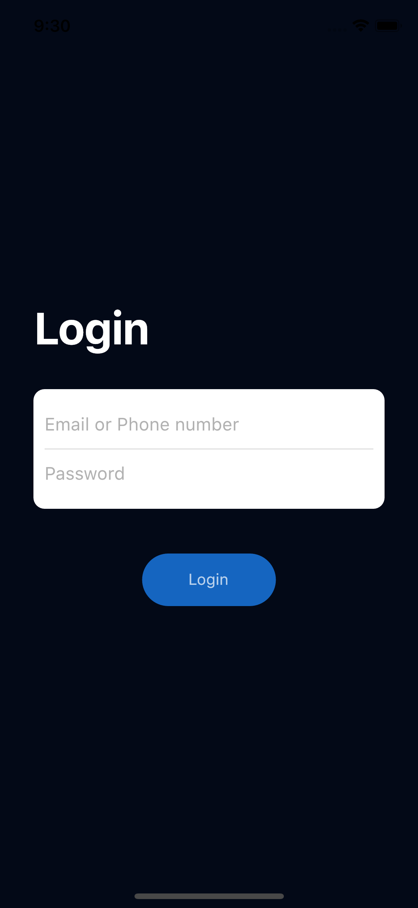

## Flutter Splash Screen Animation, Application Design

A part of #flutter100daysofcode. Let's create a beautiful and animated Splash Screen UI with Flutter.

[Watch it on Youtube](https://youtu.be/3O8VcpTgDMc)


## Development Setup
Clone the repository and run the following commands:
```
flutter pub get
flutter run
```

## ScreenShot

&nbsp;


# Splash Screen

## Structure du Projet

**lib/**: Contient le code source de l'application.
  - **main.dart**: Point d'entrée de l'application.
  
  - **pages/**: Contient les pages de l'application.
    - **home_page.dart**: Page d'accueil qui contient l'animation d'introduction.
    - **login.dart**: Page de connexion où l'utilisateur peut entrer ses informations d'identification.

  - **animation/**: Contient les animations utilisées dans l'application.
    - **fade_animation.dart**: Définition de l'animation de fondu utilisée dans l'application.

## Fonctionnalités

- **Animation d'accueil** : Une animation engageante lors du démarrage de l'application qui prépare l'utilisateur à naviguer vers la page de connexion.
- **Page de connexion** : Une interface utilisateur simple pour permettre à l'utilisateur de se connecter avec des animations douces pour améliorer l'expérience utilisateur.

## Description des fichiers

<details>
<summary>1. main.dart</summary>

- Ce fichier est le point d'entrée de l'application Flutter. Il initialise l'application et affiche la page d'accueil (`HomePage`).

</details>

<details>
<summary>2. pages/home_page.dart</summary>

- **HomePage** :
  - Cette page sert d'écran d'accueil pour l'application.
  - Elle utilise plusieurs animations, telles que des transitions de mise à l'échelle et de déplacement, pour créer un effet d'introduction engageant.
  - Lorsqu'un utilisateur appuie sur le bouton animé, il est redirigé vers la page de connexion (`LoginPage`).

- **Animations** :
  - **_scaleAnimation** : Anime la mise à l'échelle du bouton lorsqu'il est pressé.
  - **_widthAnimation** : Anime la largeur du bouton après la mise à l'échelle.
  - **_positionAnimation** : Anime la position de l'icône de flèche dans le bouton.
  - **_scale2Animation** : Anime une mise à l'échelle supplémentaire pour déclencher la transition vers la page de connexion.

</details>

<details>
<summary>3. pages/login.dart</summary>

- **LoginPage** :
  - Cette page permet à l'utilisateur de se connecter en entrant son adresse e-mail ou son numéro de téléphone et son mot de passe.
  - Elle utilise des animations de fondu pour faire apparaître progressivement les éléments de l'interface.
  - L'utilisateur peut afficher ou masquer le mot de passe en utilisant l'icône `remove_red_eye`.
  - Un bouton "Login" est disponible pour soumettre les informations d'identification.
  - Un lien "Register" est inclus pour les utilisateurs qui n'ont pas encore de compte.

</details>

<details>
<summary>4. animation/fade_animation.dart</summary>

- **FadeAnimation** :
  - Ce fichier contient la classe `FadeAnimation`, un widget stateless qui anime l'apparition (opacité) et le mouvement (translation) d'un widget enfant.
  - Il utilise la bibliothèque `simple_animations` pour définir une séquence d'animations (`MovieTween`).
  - Cette animation est utilisée dans les pages `HomePage` et `LoginPage` pour faire apparaître les éléments de l'interface de manière fluide et progressive.

</details>
